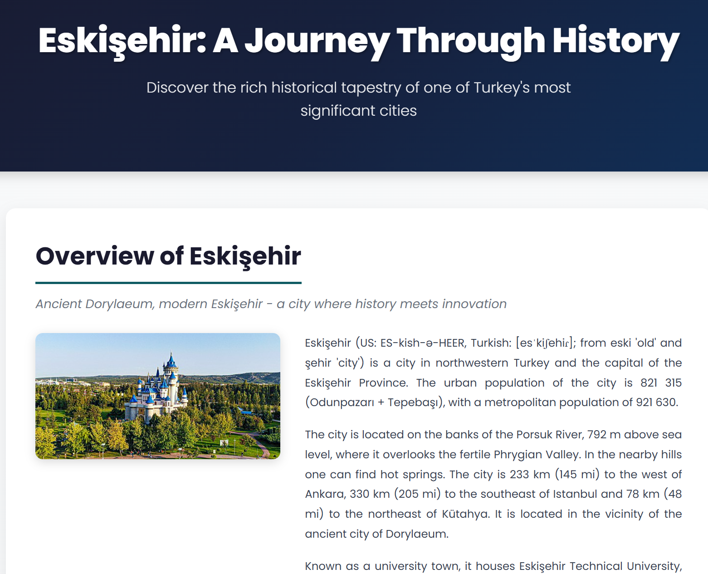

# Visit Eskişehir


An interactive web application designed to 
promote tourism in Eskişehir, Turkey. 
This project provides visitors with essential 
information about the city,
including hotel listings, weather forecasts,
cultural insights, and more.

## Project Overview

Visit Eskişehir is a React-based 
tourism web application inspired by Visit Joensuu. 
The application serves as a comprehensive guide
for tourists planning to visit Eskişehir, offering
real-time weather information, 
hotel recommendations, and 
detailed information about the city.

## Features

### Main Page 


* **Interactive Google Maps Integration**:
Embedded map showing Eskişehir's location

* **Currency Conversion** Real-time exchange rates 
for tourists planning their budget

* **City Overview** Quick introduction
to Eskişehir with key highlights

* **Responsive Navigation** Easy access to all sections of the application

### Hotels Page


- Browse available hotels in Eskişehir
- Integration with Booking.com for accommodation options
- Detailed hotel view with image galleries
- Click through to view more details about each hotel

### About Page



- Comprehensive information about Eskişehir
- Wikipedia API integration for up-to-date city information
-  Cultural and historical context
-  Points of interest and attractions

### Weather Page


- Current weather conditions in Eskişehir
-  Weather forecasts using Open-Meteo API
-  Temperature, precipitation, and other meteorological data
-  Helps visitors plan their trip timing

## Technologies Used

### Core Technologies

- React.js: Frontend framework
- Vite: Build tool and development server

### Third-Party Libraries

- axios: HTTP client for making API requests
- lucide-react: Modern icon library for React
- react-router-dom: Routing library (using hash-based navigation for compatibility)
- recharts: Charting library for data visualization
- CSS Modules: Component-scoped styling for maintainable and conflict-free CSS

### APIs Used

1. Wikipedia API (https://en.wikipedia.org/w/api.php)

Fetches detailed information about Eskişehir

2. Currency Conversion API (currency-conversion-and-exchange-rates.p.rapidapi.com)

Provides real-time exchange rates for travelers

3. Open-Meteo Weather API (https://api.open-meteo.com/)

Delivers current weather and forecast data

4. Google Maps Embed API

Displays interactive map of Eskişehir location

5. Booking.com Integration

Hotel listings and accommodation options

## Installation & Setup

### Prerequisites

* Node.js (v14 or higher)
* npm or yarn package manager

### Installation Steps

1. Extract the ZIP file

```
unzip visit-eskisehir.zip
cd visit-eskisehir
```

2. Install dependencies

```
npm install
```

or 

```
yarn install
```

3. Set up environment variables

Create a .env file in the root directory of the project and add your RapidAPI key:

```
VITE_RAPIDAPI_KEY=your_rapidapi_key_here
```

How to get a RapidAPI key:
* Visit RapidAPI
* Sign up for a free account
* Subscribe to the "Currency Conversion and Exchange Rates" API
* Copy your API key from the dashboard
* Paste it in the .env file

Without this API key, the currency converter and booking API will not work.

Make sure to get the correct API. Correct links for the subscriptions are:

* https://rapidapi.com/tipsters/api/booking-com
* https://rapidapi.com/principalapis/api/currency-conversion-and-exchange-rates

4. Run the development server

```
npm run dev
```

or

```
yarn dev
```

5. Open your browser

Navigate to http://localhost:5173
(or the port shown in your terminal)

The application should now be running.

### Build for Production

To create a production build:

```
npm run build
```

or 

```
yarn build
```

The optimized files will be in the dist/ folder.

## Application Screens

1. Home Page: Main landing page with city overview, map, and currency converter
2. Hotels Page: List of available hotels with images and basic information
3. Hotel Details Page: Detailed view of individual hotels with image gallery
4. About Page: Comprehensive information about Eskişehir from Wikipedia
5. Weather Page: Current weather and forecast information

## Key Functionalities

* Hash-based Navigation: Manual hash routing system for seamless navigation between sections
* API Integration: Real-time data from multiple external sources
* Responsive Design: Works on desktop, tablet, and mobile devices
* Interactive Elements: Clickable hotel cards, image galleries, and maps
* Information Rich: Combines multiple data sources for comprehensive tourism information
* CSS Modules: Component-scoped styling for maintainable code

## Notes

* RapidAPI Key Required: The currency converter feature requires a RapidAPI key. Make sure to set up your .env file with VITE_RAPIDAPI_KEY before running the application
* Internet connection required for all API calls and map functionality
* Hotel information is fetched from external sources and may vary
* The .env file should not be committed to version control (it's included in .gitignore)

## Author

Created as a final project for Web Development class in UEF made by [altCourier](https://github.com/altCourier)

## License

This project was created for educational purposes.

---

Enjoy exploring Eskişehir!